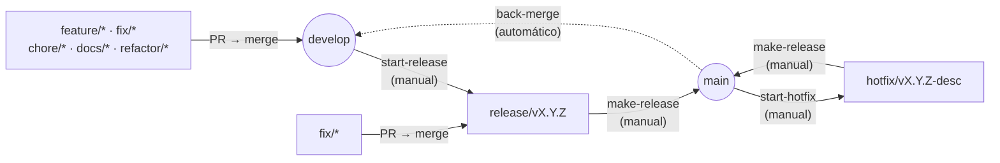
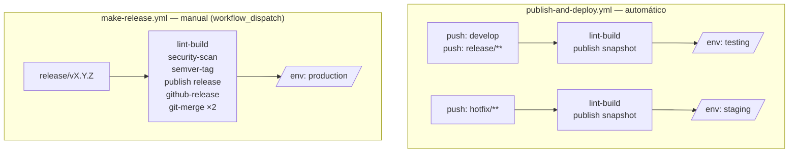
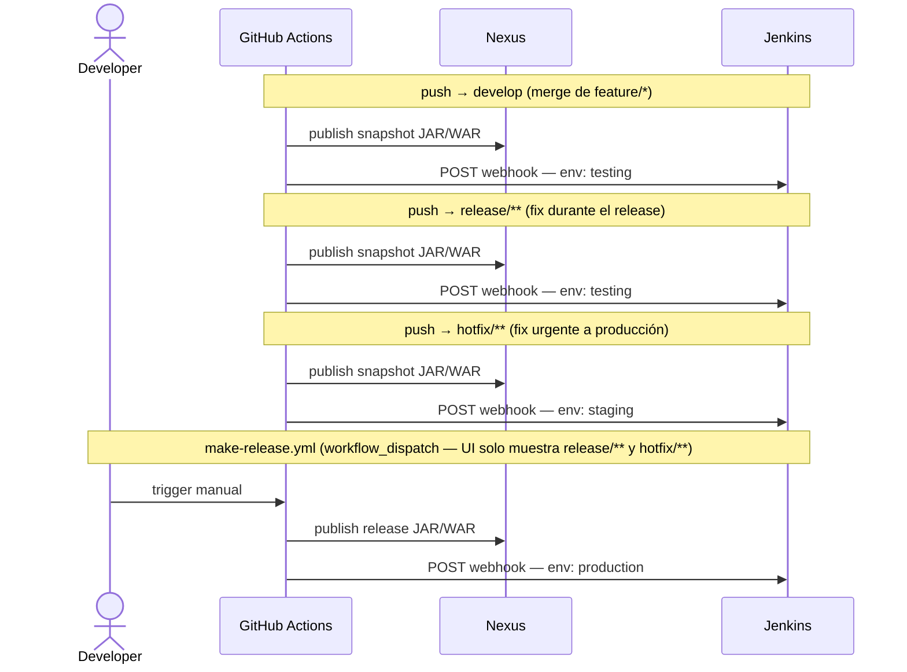

# CI/CD v2 — Guía de referencia

> Basado en el documento `BQNUY_CICD_v2_Referencia.docx.pdf` · Marzo 2026
> Audiencia: Equipo de Desarrollo · Clasificación: Confidencial — uso interno

---

## 1. Qué es CI/CD v2 y por qué existe

El repositorio `BQN-UY/CI-CD` centraliza **toda la lógica de CI/CD de la organización**.
Los repositorios de proyecto no contienen lógica de build propia — solo definen cuándo
disparar cada workflow.

### Principios de diseño

| Principio | Descripción |
|---|---|
| **Sin duplicación** | La lógica de build, lint, test y deploy vive una sola vez en CI-CD. |
| **Cero fricción** | Una línea `uses:` reemplaza decenas de pasos en cada repo. |
| **Escalabilidad** | Agregar un nuevo stack es agregar una carpeta. El resto no se toca. |
| **Seguridad por defecto** | OpenGrep y BetterLeaks corren en cada PR sin configuración adicional. |
| **SemVer 2.0 estricto** | La versión vive en el tag de Git. No hay archivos de versión que colisionen en back-merge. |

### Branching model

#### Ramas de trabajo (corta duración — siempre via PR)

| Rama | Sale de | Merge hacia | Label PR | Cuándo usar |
|---|---|---|---|---|
| `feature/*` | `develop` | `develop` | `feature` | Nueva funcionalidad retrocompatible |
| `fix/*` | `develop` · `release/**` · `hotfix/**` | mismo origen | `fix` | Corrección de bug |
| `chore/*` | `develop` | `develop` | `chore` | Mantenimiento: configuración, CI, tests |
| `docs/*` | `develop` | `develop` | `chore` | Documentación |
| `refactor/*` | `develop` | `develop` | `chore` | Refactoring sin cambio de comportamiento |
| `dependabot/*` | `develop` | `develop` | `update` | Actualización de dependencias (Dependabot) |
| `scala-steward/*` | `develop` | `develop` | `update` | Actualización de dependencias (Scala Steward) |

> `fix/*` es el único tipo que puede salir de una rama distinta a `develop`.
> Un `fix/*` desde `release/**` corrige un bug del RC; PR hacia `release/vX.Y.Z`, nunca hacia `develop`.
> Un `fix/*` desde `hotfix/**` corrige un bug secundario del hotfix; PR hacia `hotfix/vX.Y.Z-desc`.
>
> `dependabot/*` y `scala-steward/*` son creadas automáticamente por las herramientas.
> Nunca apuntan a `release/**` ni `hotfix/**` — las actualizaciones de deps en esos contextos son excepcionales y se hacen manualmente como `fix/*` si son críticas.

#### Ramas de ciclo (larga duración — gestionadas por workflows)



---

## 2. Estructura del repositorio CI-CD

GitHub Actions requiere que cada action tenga su propio `action.yml` en la raíz de su
carpeta. La estructura usa dos niveles de agrupación: **capa** (`shared`, `frontend`,
`backend`) y **stack** (`python`, `scala`, `flutter`, etc.).

```
BQN-UY/CI-CD
└── .github/
    └── actions/
        ├── shared/                      # No sabe nada del lenguaje
        │   ├── security-scan/
        │   │   └── action.yml
        │   ├── semver-tag/
        │   │   └── action.yml
        │   ├── git-merge/
        │   │   └── action.yml
        │   ├── github-release/
        │   │   └── action.yml
        │   ├── jenkins-deploy-trigger/
        │   │   └── action.yml
        │   ├── label-check/
        │   │   └── action.yml
        │   └── auto-label/
        │       └── action.yml
        │
        ├── frontend/
        │   ├── html-js/
        │   │   └── lint-build/          # ESLint + Prettier + build
        │   │       └── action.yml
        │   ├── vaadin/
        │   │   └── lint-build/          # Maven + Checkstyle + Java
        │   │       └── action.yml
        │   └── flutter/
        │       ├── lint-test/           # flutter analyze + test
        │       │   └── action.yml
        │       └── build-apk/           # apk / ipa / web
        │           └── action.yml
        │
        └── backend/
            ├── python/
            │   └── lint-test/           # Ruff + mypy + pytest
            │       └── action.yml
            ├── scala/
            │   └── lint-build/          # scalafmt + sbt compile + test
            │       └── action.yml
            └── node/
                └── lint-test/           # ESLint + Jest/Vitest
                    └── action.yml
```

### Regla para ubicar una action nueva

Responder en orden:

1. ¿Menciona algún lenguaje, runtime o toolchain? Si **no** → `shared/`. Fin.
2. ¿Produce algo que el usuario final consume directamente? Si **sí** → `frontend/`. Si **no** → `backend/`.
3. ¿Qué tecnología usa internamente? Esa es la subcarpeta: `python/`, `scala/`, `flutter/`, etc.

### Cómo se referencia desde un workflow de proyecto

El path del `uses:` siempre sigue el mismo patrón:

```yaml
# Shared — igual para cualquier repo
- uses: BQN-UY/CI-CD/.github/actions/shared/security-scan@v2
- uses: BQN-UY/CI-CD/.github/actions/shared/semver-tag@v2

# Frontend HTML+JS
- uses: BQN-UY/CI-CD/.github/actions/frontend/html-js/lint-build@v2

# Backend Python
- uses: BQN-UY/CI-CD/.github/actions/backend/python/lint-test@v2

# Backend Scala
- uses: BQN-UY/CI-CD/.github/actions/backend/scala/lint-build@v2
```

---

## 2.bis Reusable workflows (`.github/workflows/<stack>-<tipo>-*.yml`)

A partir de v2, además de las composite actions, hay **reusable workflows** que componen las actions y exponen un `on: workflow_call`. Esto permite que los repos cliente solo declaren un caller corto y se mantengan sincronizados automáticamente con el tag `@v2`.

### Convenciones

- Subcarpetas no soportadas en `.github/workflows/` → la taxonomía va en el nombre: `<stack>-<tipo>-<workflow>.yml`
- Los reusable workflows siempre tienen `on: workflow_call`
- Los `secrets` se pasan con `secrets: inherit` desde el caller (requiere que los nombres coincidan con los documentados en §6)
- Las labels (tipo + tamaño) y otros workflows agnósticos usan nombre sin prefijo de stack: `setup-labels.yml`

### Catálogo actual

| Reusable workflow | Tipo de proyecto | Trigger del caller |
|---|---|---|
| `scala-api-ci.yml` | API Scala | `pull_request` + `push` release/hotfix |
| `scala-api-publish.yml` | API Scala | `push` develop / release / hotfix |
| `scala-api-make-release.yml` | API Scala | `workflow_dispatch` |
| `scala-api-start-release.yml` | API Scala | `workflow_dispatch` |
| `scala-api-start-hotfix.yml` | API Scala | `workflow_dispatch` |
| `setup-labels.yml` | Cualquiera | `workflow_dispatch` |

### Caller mínimo

```yaml
# .github/workflows/ci.yml en el repo del proyecto
name: CI
on:
  pull_request:
    branches: [develop, "release/**", "hotfix/**"]
  push:
    branches: ["release/**", "hotfix/**"]
jobs:
  ci:
    uses: BQN-UY/CI-CD/.github/workflows/scala-api-ci.yml@v2
    secrets: inherit
```

Los templates en `templates/<stack>-<tipo>/` ya contienen los callers listos para copiar.

### Cómo agregar un nuevo stack/tipo (ej. `scala-lib`, `vaadin-war`, `python-api`)

1. Crear `.github/workflows/<stack>-<tipo>-<workflow>.yml` con `on: workflow_call` componiendo las composite actions correspondientes
2. Crear `templates/<stack>-<tipo>/` con los callers cortos
3. Documentar en este archivo

---

## 3. Actions compartidas (`shared/`)

Las actions de `shared/` no contienen lógica de stack. Se usan igual desde cualquier tipo
de repo y nunca deben modificarse al agregar un nuevo lenguaje.

### 3.1 `shared/label-check`

Verifica que el PR tenga exactamente uno de los labels obligatorios. Si no hay label,
el CI falla y el merge queda bloqueado.

**Labels aceptados:** `breaking-change` · `feature` · `fix` · `chore` · `deploy-action`

**Input requerido:**

| Input | Descripción |
|---|---|
| `github-token` | `GITHUB_TOKEN` del repo que invoca |

---

### 3.2 `shared/auto-label`

Asigna automáticamente una label al PR según el prefijo del branch. Debe correr **antes** de `label-check` para que la verificación encuentre la label ya puesta.

| Prefijo de branch | Label asignada |
|---|---|
| `feature/` | `feature` |
| `fix/` | `fix` |
| `chore/` | `chore` |
| `hotfix/` | `fix` |
| `release/` | `deploy-action` |

Si el branch no coincide con ningún prefijo la action no falla — simplemente no asigna nada (el developer debe agregar la label manualmente o `label-check` bloqueará el merge).

Si el PR ya tiene alguna de las labels gestionadas (puesta manualmente o por una ejecución anterior), la action no agrega nada para evitar que `label-check` falle por tener más de una label.

PRs desde forks son ignorados por seguridad: la action no intenta modificar labels cuando el head repo no coincide con el repo base.

> **Relación con `.github/labeler.yml`:** la sección 8.2 documenta el uso de `.github/labeler.yml` para auto-etiquetar PRs. Ambos mecanismos son complementarios: `shared/auto-label` cubre el caso simple de etiquetar según el prefijo del branch, mientras que `.github/labeler.yml` permite reglas más avanzadas por archivos modificados. Para migraciones a CI/CD v2 se recomienda usar `shared/auto-label` como opción por defecto y agregar `.github/labeler.yml` solo cuando se necesiten reglas adicionales.

**Input requerido:**

| Input | Descripción |
|---|---|
| `github-token` | `GITHUB_TOKEN` del repo que invoca |

> **Permisos requeridos:** esta action llama a `issues.addLabels`. El workflow que la use debe declarar `permissions: issues: write`; de lo contrario fallará en repos con token read-only por defecto.

**Uso en `ci.yml` del proyecto:**

```yaml
auto-label:
  runs-on: ubuntu-latest
  permissions:
    issues: write
  steps:
    - uses: BQN-UY/CI-CD/.github/actions/shared/auto-label@v2
      with:
        github-token: ${{ secrets.GITHUB_TOKEN }}

label-check:
  needs: auto-label
  runs-on: ubuntu-latest
  steps:
    - uses: BQN-UY/CI-CD/.github/actions/shared/label-check@v2
      with:
        github-token: ${{ secrets.GITHUB_TOKEN }}
```

---

### 3.3 `shared/pr-size-label`

Etiqueta el PR con su tamaño (`size/xs`, `size/s`, `size/m`, `size/l`, `size/xl`) según líneas y archivos modificados.
Envuelve [`codelytv/pr-size-labeler`](https://github.com/CodelyTV/pr-size-labeler) con thresholds por defecto.

| Tamaño | Líneas | Archivos |
|---|---|---|
| `size/xs` | ≤10 | ≤2 |
| `size/s`  | ≤100 | ≤10 |
| `size/m`  | ≤500 | ≤30 |
| `size/l`  | ≤1000 | ≤100 |
| `size/xl` | >1000 | >100 |

Cualquier umbral es ajustable vía inputs (`xs-max-size`, `files-xs-max-size`, etc.).
Por defecto ignora lockfiles (`package-lock.json`, `yarn.lock`, `*.lock`, `build.sbt.lock`).

Requiere `permissions: pull-requests: write` en el job que la invoca.
Se omite automáticamente en PRs desde forks (donde el token viene con permisos read-only).

```yaml
pr-size-label:
  name: Etiquetar tamaño de PR
  runs-on: ubuntu-latest
  if: github.event_name == 'pull_request'
  permissions:
    pull-requests: write
  steps:
    - uses: BQN-UY/CI-CD/.github/actions/shared/pr-size-label@v2
      with:
        github-token: ${{ secrets.GITHUB_TOKEN }}
```

> Las labels `size/*` son informativas — `label-check` no las cuenta como label de tipo.

---

### 3.4 `shared/security-scan`

Corre **OpenGrep** (SAST) y **BetterLeaks** (secrets scanning) sobre el código.
Si encuentra algo, el CI falla y el PR no puede mergearse.

- OpenGrep genera un reporte SARIF y, si el workflow tiene `permissions: security-events: write`, lo sube al tab de *Security* del repo. Si el permiso no está configurado, el análisis corre igual pero el reporte no se publica.
- BetterLeaks falla con `--fail-on-findings` si detecta un secreto.

No requiere inputs — opera sobre el checkout actual. Para que el upload de SARIF funcione, el workflow que la invoca debe declarar `permissions: security-events: write`.

---

### 3.5 `shared/semver-tag`

Crea un tag SemVer 2.0 anotado (no firmado con GPG). Soporta dos modos:

- **Modo `bump`** (usado en `start-release` y `start-hotfix`): calcula la próxima versión leyendo el tag más reciente en el historial Git e incrementando según `major`/`minor`/`patch`.
- **Modo `tag`** (usado en `make-release`): recibe el tag exacto a crear, derivado del nombre de la rama (`release/vX.Y.Z` o `hotfix/vX.Y.Z-desc`). Garantiza que el tag coincide con la versión indicada en la rama.

Si se requieren tags firmados con GPG, el manejo de claves y la firma deben implementarse en el workflow que invoca esta action.

> **Permisos requeridos:** esta action hace push de tags al repositorio remoto. El workflow
> que la use debe declarar `permissions: contents: write` (o utilizar un PAT con permisos
> equivalentes); de lo contrario el push fallará si el `GITHUB_TOKEN` es read-only por defecto.

**Inputs:**

| Input | Descripción | Default |
|---|---|---|
| `bump` | `major` \| `minor` \| `patch` — ignorado si se usa `tag` | `minor` |
| `tag` | Tag exacto a crear (ej. `v1.3.0`). Si se provee, omite el cálculo de bump. | — |
| `prefix` | Prefijo del tag | `v` |
| `dry-run` | Solo calcula, no crea el tag | `false` |

**Outputs:**

| Output | Ejemplo |
|---|---|
| `version` | `1.3.0` |
| `tag` | `v1.3.0` |

---

### 3.6 `shared/git-merge`

Realiza un back-merge automático sin conflictos. Al no existir archivos de versión
(no hay `version.sbt` ni equivalente), este paso siempre es limpio.

**Inputs:**

| Input | Descripción |
|---|---|
| `source` | Rama de origen (ej. `main`) |
| `target` | Rama de destino (ej. `develop`) |

---

### 3.7 `shared/github-release`

Crea un GitHub Release con release notes autogeneradas a partir de los PRs incluidos
y sus labels. Usa `softprops/action-gh-release@v2`.

**Input requerido:**

| Input | Descripción |
|---|---|
| `tag` | Tag a publicar (ej. `v1.3.0`) |

---

### 3.8 `shared/jenkins-deploy-trigger`

Dispara el deploy vía [Generic Webhook Trigger (GWT)](https://plugins.jenkins.io/generic-webhook-trigger/)
de Jenkins. El token se envía como query param `?token=` — GWT lo usa para rutear
al job Jenkins correcto. Falla si el webhook devuelve un status distinto de `200` o `204`.

**Inputs:**

| Input | Requerido | Descripción |
|---|---|---|
| `environment` | ✅ | `testing` \| `staging` \| `production` |
| `service-url` | ✅ | URL base del webhook GWT (`JENKINS_DEPLOY_URL`) |
| `token` | ✅ | Token GWT del job Jenkins — determina el ambiente de destino |
| `sistema` | — | Nombre del servicio a desplegar (var `SISTEMA` del repo) |
| `version` | — | Versión del artefacto (dynver snapshot o tag release) |

> Los secrets `JENKINS_DEPLOY_URL` y los tres tokens son org-level (BQN-UY) — no
> requieren configuración por repo. Ver detalles completos en [`docs/jenkins.md`](jenkins.md).

---

## 4. Caso 1 — Backend: Scala / Pekko REST API

### 4.1 Action de stack: `backend/scala/lint-build`

Build completo con sbt: `scalafmt check` + `compile` + `test`.
El versionado usa **sbt-dynver** — no existe `version.sbt`.

**Inputs:**

| Input | Default |
|---|---|
| `java-version` | `"21"` |
| `scala-version` | `"3.4.2"` |

**Pasos que ejecuta:**

1. Setup Java (Temurin) con cache de sbt
2. Setup sbt
3. `sbt scalafmtCheckAll`
4. `sbt compile`
5. `sbt test`

---

### 4.2 Versionado: sbt-dynver

No existe `version.sbt`. El plugin `sbt-dynver` calcula la versión en build-time
leyendo el historial de Git:

| Situación | Rama | Versión calculada |
|---|---|---|
| Commit = tag `v1.2.0` | `main` | `1.2.0` |
| 3 commits después de `v1.2.0` | `develop` | `1.2.0+3-abc1234` |
| 5 commits en hotfix | `hotfix/v1.1.1` | `1.1.0+5-def5678` |
| Árbol sucio (local) | cualquiera | `1.2.0+3-abc1234+dirty` |

> **Sin conflictos en back-merge:** al no existir `version.sbt`, el back-merge
> automático de `hotfix → develop` siempre es limpio. Fue el problema histórico
> que este modelo resuelve.

---

### 4.3 Workflows del proyecto Scala

Los workflows viven en el repositorio del proyecto (ej. `BQN-UY/mi-api-scala`),
no en CI-CD.

#### `ci.yml` — se dispara en PRs y pushes a release/hotfix

```
Trigger: PR → develop · PR → release/** · PR → hotfix/**  |  push → release/** y hotfix/**
         (cubre fix/* branches que apuntan a release/** o hotfix/**)

Jobs:
  verify-label  → shared/label-check        (solo en PR)
  lint-build    → backend/scala/lint-build
  security      → shared/security-scan
```

#### `publish-and-deploy.yml` — publica snapshot a Nexus y despliega automáticamente

```
Trigger: push → develop  |  push → hotfix/**  |  push → release/**

La versión la calcula sbt-dynver automáticamente (formato: 1.2.0+3-abc1234).
Pasos:
  1. backend/scala/lint-build
  2. sbt publish                → publica JAR snapshot en Nexus
  3. shared/jenkins-deploy-trigger      → deploy a testing (rama == develop o release/**)
                                → deploy a staging (rama == hotfix/**)
```

#### `start-release.yml` — crea la release branch

```
Trigger: workflow_dispatch (siempre opera sobre develop — guard if: github.ref_name == 'develop')
Input:   bump (major | minor | patch)

Pasos:
  1. Checkout develop con historial completo
  2. shared/semver-tag (dry-run: true) → calcula la próxima versión
  3. Crea y pushea branch release/v{version}
```

#### `make-release.yml` — hace el release completo a production

```
Trigger: workflow_dispatch
         branches: release/** · hotfix/**
         (el selector del UI solo muestra estas ramas; seleccionar la correcta manualmente —
          si hay hotfix/** activo tiene prioridad sobre release/**)


Pasos:
  1. backend/scala/lint-build
  2. shared/security-scan
  3. Extraer versión desde nombre de rama (release/vX.Y.Z → vX.Y.Z)
  4. shared/semver-tag (tag: vX.Y.Z) → crea el tag Git exacto
  5. sbt publish                    → publica JAR release en Nexus maven-releases
  6. shared/github-release          → crea GitHub Release con notas
  7. shared/git-merge               → merge release → main
  8. shared/git-merge               → back-merge main → develop
  9. shared/jenkins-deploy-trigger          → deploy a production
```

#### Fixes durante el ciclo de release — cambio de comportamiento respecto a v1

> **Diferencia clave con v1:** En v1 no se usaban ramas `release/**` ni `develop`.
> En v2 este flujo cambia y es importante internalizarlo.

Una vez ejecutado `start-release.yml`, la rama `release/vX.Y.Z` y `develop` son
**independientes**. Los cambios que se pusheen a `develop` después de ese punto
son para la **próxima versión** — no se incluyen en el release en curso ni
re-publican en staging.

**Si durante el testeo en testing se detecta un problema, el fix va a `release/vX.Y.Z` directamente — nunca a `develop`.**

```
develop ──●──●──[start-release]──●──●──●──  ← próxima versión → testing
                      │
          release/vX.Y.Z ──[fix]──[fix]──   ← fixes del release actual → testing
                                    │
                              make-release → production
                                    │
                              back-merge → develop  ← los fixes vuelven aquí al final
```

El ciclo completo de un fix en release:

```
1. Commit del fix directo en release/vX.Y.Z  (o PR hacia release/vX.Y.Z)
2. push → publish-and-deploy.yml             → snapshot Nexus + deploy testing
3. Validar en testing
4. Si OK → make-release.yml                  → tag + Nexus release + GitHub Release
                                             → merge release → main
                                             → back-merge main → develop
                                             → deploy production
```

#### `start-hotfix.yml` — crea la hotfix branch

```
Trigger: workflow_dispatch (siempre opera sobre main — guard if: github.ref_name == 'main')
         main == último tag de release: make-release siempre mergea a main y crea el tag
         en ese mismo commit, por lo que partir de main es partir del estado de producción.
Input:   description (ej. "fix-null-parser")

Pasos:
  1. Checkout main con historial completo
  2. shared/semver-tag (dry-run: true, bump: patch) → calcula versión patch
  3. Crea branch hotfix/v{version}-{description}
```

---

## 5. Caso 2 — Frontend: HTML+JS / Backend: Python 3 + FastAPI

### 5.1 Actions de stack

#### `frontend/html-js/lint-build`

ESLint + Prettier check + npm build. Genera el artefacto en `/dist`.

| Input | Default |
|---|---|
| `node-version` | `"20"` |

Pasos: Setup Node → `npm ci` → `npx eslint` → `npx prettier --check` → `npm run build`

#### `backend/python/lint-test`

Ruff lint + format check + mypy + pytest.

| Input | Default |
|---|---|
| `python-version` | `"3.12"` |

Pasos: Setup Python → `pip install` → `ruff check` → `ruff format --check` → `mypy` → `pytest`

---

### 5.2 Workflows — Frontend HTML+JS

#### `ci.yml`
```
Jobs: verify-label + lint-build (html-js) + security
```

#### `publish-and-deploy.yml`
El snapshot del frontend es el artefacto `/dist` guardado en GitHub Actions Artifacts
(no en Nexus). Si hay CDN o storage propio, se agrega un paso de upload.
Después del upload, se dispara `shared/jenkins-deploy-trigger`: `environment: testing` si la rama es `develop` o `release/**`, `environment: staging` si la rama es `hotfix/**`.

#### `make-release.yml`
```
Pasos:
  1. frontend/html-js/lint-build
  2. shared/security-scan
  3. shared/semver-tag              → crea el tag Git
  4. shared/github-release          → crea GitHub Release (adjunta /dist)
  5. shared/git-merge               → merge release → main
  6. shared/git-merge               → back-merge main → develop
  7. shared/jenkins-deploy-trigger          → dispara deploy via webhook
```

---

### 5.3 Workflows — Backend Python/FastAPI

#### `ci.yml`
```
Jobs: verify-label + lint-test (python) + security
```

#### `publish-and-deploy.yml`
El snapshot de Python es una **imagen Docker** publicada en GHCR (GitHub Container
Registry), equivalente a los maven-snapshots del stack Scala.

```
Tag de imagen: ghcr.io/bqn-uy/{repo}:{github.sha}
```

Después de publicar la imagen, se dispara `shared/jenkins-deploy-trigger`: `environment: testing` si la rama es `develop` o `release/**`, `environment: staging` si la rama es `hotfix/**`.

#### `make-release.yml`
```
Pasos:
  1. backend/python/lint-test
  2. shared/security-scan
  3. shared/semver-tag              → crea el tag Git
  4. docker/build-push-action       → publica imagen con tag v{version} + latest
  5. shared/github-release          → crea GitHub Release
  6. shared/git-merge               → merge release → main
  7. shared/git-merge               → back-merge main → develop
  8. shared/jenkins-deploy-trigger          → dispara deploy via webhook
```

---

## 6. Resumen comparativo de stacks

### Semántica de ambientes

| Rama | Nexus | Ambiente | Propósito |
|---|---|---|---|
| `develop` | snapshots | testing | Features de la próxima versión |
| `release/**` | snapshots | testing | Fixes del release en curso |
| `hotfix/**` | snapshots | staging | Fix urgente a producción |
| `make-release` | **releases** | production | Versión definitiva |

- **testing** — todo lo que está siendo desarrollado o corregido para la próxima versión. Nunca se mezcla con fixes de producción.
- **staging** — espejo de producción, exclusivo para validar hotfixes antes de aplicarlos. Siempre refleja un estado cercano a lo que hay en producción.
- **production** — único deploy irreversible, solo vía `make-release` manual.

### Actions y environments



### Action de stack por tipo de repo

| Tipo de repo | Action de stack | Actions shared (siempre presentes) |
|---|---|---|
| Frontend HTML+JS | `frontend/html-js/lint-build` | `label-check`, `security-scan`, `semver-tag`, `git-merge`, `github-release`, `jenkins-deploy-trigger` |
| Frontend Vaadin | `frontend/vaadin/lint-build` | ídem |
| Frontend Flutter | `frontend/flutter/lint-test` + `build-apk` | ídem |
| Backend Python/FastAPI | `backend/python/lint-test` | ídem |
| Backend Scala/Pekko | `backend/scala/lint-build` | ídem |
| Backend Node.js | `backend/node/lint-test` | ídem |

### Artefacto publicado por stack

| Stack | Snapshot | Release |
|---|---|---|
| Scala/Pekko | JAR en Nexus maven-snapshots | JAR en Nexus maven-releases + GitHub Release |
| Python/FastAPI | Imagen Docker en GHCR (SHA tag) | Imagen Docker en GHCR (`vX.Y.Z` + `latest`) + GitHub Release |
| HTML+JS | Artefacto `/dist` en Actions Artifacts | Artefacto `/dist` adjunto en GitHub Release |
| Vaadin | WAR/JAR en Nexus maven-snapshots | WAR/JAR en Nexus maven-releases + GitHub Release |
| Flutter | APK/IPA en Actions Artifacts | APK/IPA adjunto en GitHub Release |

### Interacciones con servicios externos

> Aplica a stacks que usan Nexus (Scala/Pekko, Vaadin). Python publica en GHCR (GitHub); HTML+JS y Flutter en Actions Artifacts — ninguno de los dos interactúa con Nexus ni Jenkins directamente.



### Conventional Commits y labels de PR

| Label PR | Tipo de commit | Bump SemVer sugerido | Asignado por |
|---|---|---|---|
| `breaking-change` | `feat(scope)!` o `fix!` | MAJOR (`1.2.3 → 2.0.0`) | Manual |
| `feature` | `feat:` | MINOR (`1.2.3 → 1.3.0`) | `auto-label` / manual |
| `fix` | `fix:` | PATCH (`1.2.3 → 1.2.4`) | `auto-label` / manual |
| `chore` | `chore:`, `docs:`, `refactor:` | PATCH | `auto-label` / manual |
| `update` | `chore(update):` | PATCH | `auto-label` (Dependabot/Scala Steward) |
| `deploy-action` | Cualquiera + infra requerida | Independiente del bump | `auto-label` (`release/`) / manual |

> **`update`:** label exclusivo para actualizaciones de dependencias generadas por Dependabot
> o Scala Steward. Separado de `chore` para que el changelog identifique claramente
> las actualizaciones de libs. `auto-label` lo asigna automáticamente para ramas
> `dependabot/*` y `scala-steward/*`. Ambas herramientas deben configurarse con
> `target-branch: develop` y `labels: ["update"]`.

> **`deploy-action`:** el PR requiere una acción manual en la infraestructura antes
> o durante el deploy — por ejemplo: nueva variable de entorno, migración de base de
> datos, nuevo secret, nuevo componente de infra (queue, bucket, etc.).
> Reemplaza al label de tipo (`feature`, `fix`, etc.) — el tipo de cambio se describe
> en el cuerpo del PR y la acción requerida en la sección "Deploy action requerida"
> del PR template. Es el label más crítico del flujo: mergear sin ejecutar la acción
> previa puede romper el ambiente.

> **`breaking-change` vs `deploy-action`:** son dimensiones distintas.
> `breaking-change` = los consumidores de la API deben actualizar su código.
> `deploy-action` = el ambiente necesita preparación antes del deploy.
> No pueden coexistir como labels (label-check exige exactamente uno) — si un PR
> es ambos, usar `deploy-action` y documentar el breaking change en el cuerpo del PR.

---

## 7. Cómo agregar un nuevo stack

La estructura está diseñada para escalar sin modificar nada existente.
El procedimiento es siempre el mismo:

1. Decidir la capa: ¿`frontend/` o `backend/`?
2. Crear la subcarpeta con el nombre del stack:
   - `.github/actions/frontend/go/lint-build/`
   - `.github/actions/backend/go/lint-test/`
3. Escribir el `action.yml` usando como plantilla cualquier action existente del mismo tipo.
4. En el repo del proyecto, agregar el `uses:` correspondiente en los workflows.
   Las shared actions no cambian.
5. Abrir PR en `BQN-UY/CI-CD` con label `feature`. El CI valida que la nueva action funcione.

> **Zero impacto en repos existentes:** agregar `backend/go/lint-test/` no toca ningún
> workflow de Python, Scala ni ningún otro stack. El principio de aislamiento está
> garantizado por la estructura de carpetas.

---

## 8. Archivos de soporte en cada repo de proyecto

Estos archivos van en el repositorio del proyecto, no en CI-CD.

### 8.1 `.github/pull_request_template.md`

Guía al desarrollador para completar la información del PR y asignar el label correcto.

```markdown
## Descripción
<!-- Qué hace este PR y por qué -->

## Tipo de cambio (seleccionar label en GitHub — obligatorio)
- [ ] `feature`          — nueva funcionalidad retrocompatible
- [ ] `fix`              — corrección de bug retrocompatible
- [ ] `breaking-change`  — rompe compatibilidad de API
- [ ] `chore`            — refactor, configuración, CI, tests
- [ ] `update`             — actualización de dependencias (Dependabot / Scala Steward)
- [ ] `deploy-action`    — requiere acción manual en infra antes/durante el deploy

## Deploy action requerida
<!-- Si marcaste deploy-action, describir exactamente qué debe hacerse -->
<!-- Ej: migración DB, nueva variable de entorno, cambio de config -->
N/A

## Checklist
- [ ] Tests pasan localmente
- [ ] No hay secrets hardcodeados
- [ ] PR tiene exactamente un label asignado
```

### 8.2 `CLAUDE.md` y `.github/copilot-instructions.md`

Proveen contexto del proyecto a los asistentes de AI (Claude Code y GitHub Copilot
respectivamente). Con estos archivos presentes, el AI comprende el branching model,
la semántica de ambientes y las reglas del CI/CD sin necesidad de consultar la
documentación de `BQN-UY/CI-CD`.

Los templates listos para copiar están en `BQN-UY/CI-CD`:

```
templates/<stack>/CLAUDE.md
templates/<stack>/.github/copilot-instructions.md
```

Ambos archivos cubren:
- Branching model y para qué sirve cada rama
- Tabla de ambientes (qué rama despliega a dónde y por qué)
- Reglas críticas (ej. fixes de release nunca van a `develop`)
- Workflows disponibles y sus triggers
- Secrets requeridos y su patrón de nombres
- Qué no hacer (guía de errores comunes)

> Al incorporar un nuevo desarrollador o iniciar una sesión con un AI en el repo,
> estos archivos garantizan que el asistente opere con el mismo modelo mental
> que el equipo — sin alucinaciones sobre el flujo de trabajo.

### 8.3 Herramientas de actualización de dependencias

Las responsabilidades están divididas para evitar solapamiento y garantizar cobertura completa:

| Herramienta | Scope | Configuración |
|---|---|---|
| **Dependabot** | Deps públicas (Maven Central, Sonatype) + GitHub Actions | Por repo — `.github/dependabot.yml` |
| **Scala Steward** | Deps internas `com.bqn` y `com.zistemas` vía Nexus privado | Central — `BQN-UY/CI-CD` + `.scala-steward.conf` por repo |

> Dependabot no puede acceder a repos Maven privados con autenticación — por eso
> Scala Steward cubre las librerías internas.

#### `.github/dependabot.yml` (por repo — template en `templates/scala-api/`)

```yaml
version: 2
updates:
  # Dependencias públicas (Maven Central, Sonatype, etc.)
  # Las dependencias internas com.bqn y com.zistemas son responsabilidad de Scala Steward.
  - package-ecosystem: "sbt"
    directory: "/"
    schedule:
      interval: "weekly"
    target-branch: "develop"
    labels:
      - "update"
    open-pull-requests-limit: 5
    ignore:
      - dependency-name: "com.bqn:*"
      - dependency-name: "com.zistemas:*"

  # GitHub Actions
  - package-ecosystem: "github-actions"
    directory: "/"
    schedule:
      interval: "weekly"
    target-branch: "develop"
    labels:
      - "update"
    open-pull-requests-limit: 5
```

#### `.scala-steward.conf` (por repo — template en `templates/scala-api/`)

```hocon
# Scala Steward gestiona SOLO dependencias internas de BQN-UY.
# Las dependencias públicas (Maven Central, etc.) son responsabilidad de Dependabot.
updates.allow = [
  { groupId = "com.bqn" },
  { groupId = "com.zistemas" }
]

updatePullRequests = "always"
commits.message = "chore(update): update ${artifactName} ${currentVersion} → ${nextVersion}"
updates.includeScala = false
updates.ignore = [
  { groupId = "org.scala-lang", artifactId = "scala-library" }
]
```

#### Runner central de Scala Steward (en `BQN-UY/CI-CD`)

Scala Steward corre centralmente en este repo (`BQN-UY/CI-CD`) via
`.github/workflows/scala-steward.yml`. La lista de repos gestionados está en
`scala-steward/repos.md`. Para agregar un nuevo repo al ciclo de actualizaciones:

1. Copiar `.scala-steward.conf` desde `templates/scala-api/` al repo del proyecto
2. Agregar `- BQN-UY/<nombre-repo>` en `scala-steward/repos.md`

**Requisitos org-level para el runner:**

| Nombre | Tipo | Descripción |
|---|---|---|
| `SYSADMIN_PAT` | secret | PAT de `bqn-sysadmin` — ya existe org-level, scope `repo` |
| `NEXUS_USER` | secret | Usuario Nexus — ya existe org-level, acceso de lectura es suficiente |
| `NEXUS_PASSWORD` | secret | Contraseña Nexus — ya existe org-level |
| `vars.NEXUS_URL` | variable | URL base del Nexus — no es secret, ya existe org-level |

> Ninguna herramienta debe apuntar a `release/**` ni `hotfix/**`.
> Una actualización de dep urgente en esos contextos se hace manualmente como `fix/*`.

### 8.4 `.github/labeler.yml`

Aplica labels automáticamente según el nombre de la rama fuente del PR.

```yaml
breaking-change:
  - head-branch: [".*breaking.*", ".*BREAKING.*"]

feature:
  - head-branch: ["feature/.*"]

fix:
  - head-branch: ["fix/.*", "hotfix/.*"]

chore:
  - head-branch: ["chore/.*", "docs/.*", "refactor/.*"]

deps:
  - head-branch: ["dependabot/.*", "scala-steward/.*"]
```

> `shared/auto-label` cubre estos mismos patrones sin necesidad de `.github/labeler.yml`.
> Usar `labeler.yml` solo si se necesitan reglas adicionales por archivos modificados.

---

## 9. Roles y responsabilidades

| Responsabilidad | Desarrollador | DevOps / Infra |
|---|---|---|
| Actions shared (CI-CD) | Propone cambios vía PR | Owner — aprueba y mergea |
| Actions de stack (CI-CD) | Owner — escribe y mantiene | Revisa |
| Workflows del proyecto | Owner | Revisa |
| Secrets del repo | — | Owner |
| Seguridad — hallazgos SAST | Resuelve | Asesora |
| Secretos detectados | Rota y limpia historial | Asesora |
| Decidir bump SemVer | Owner (en `make-release`) | — |
| Decidir `breaking-change` | Owner (en PR) | — |
| Decidir `deploy-action` | Owner (en PR) | Ejecuta en ambiente |

---

## 10. Glosario rápido

| Término | Significado en este contexto |
|---|---|
| **Composite action** | Action de GitHub definida en `action.yml` con `runs.using: composite`. Puede usarse como paso dentro de cualquier workflow. |
| **sbt-dynver** | Plugin de sbt que calcula la versión del proyecto leyendo el historial Git, sin necesidad de `version.sbt`. |
| **back-merge** | Merge automático de `main → develop` luego de un release, para mantener develop actualizado. |
| **SAST** | Static Application Security Testing. Análisis estático de código en busca de vulnerabilidades. |
| **GHCR** | GitHub Container Registry. Registro de imágenes Docker integrado en GitHub. |
| **webhook deploy** | Mecanismo donde el CI llama a un endpoint HTTP para disparar el deploy, en lugar de conectarse via SSH a Jenkins. |
| **dry-run** | Modo de ejecución que calcula el resultado (ej. próxima versión) sin efectuar cambios reales en el sistema. |
