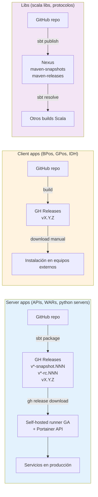
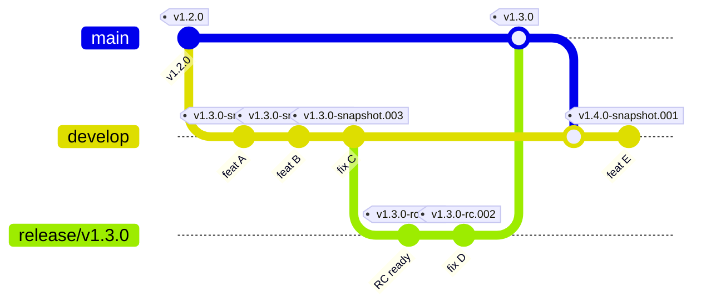
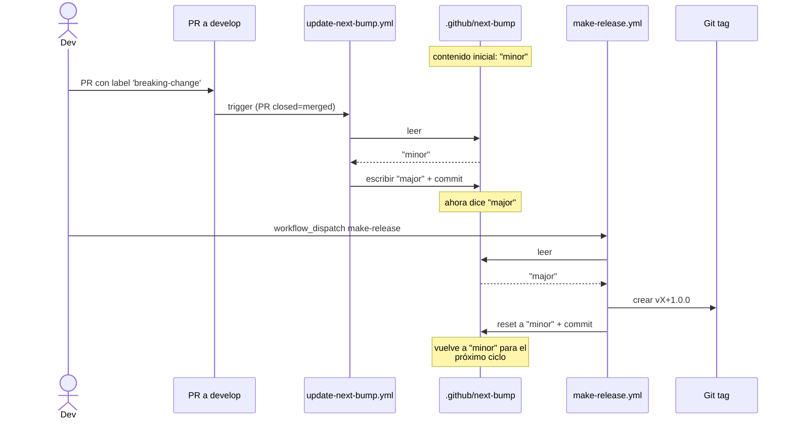
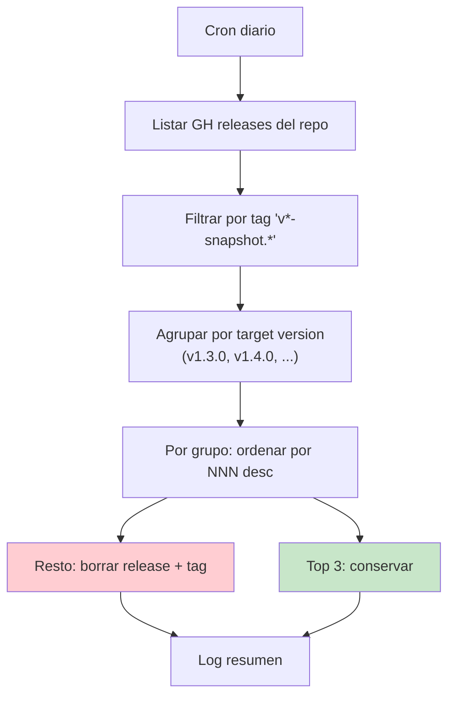
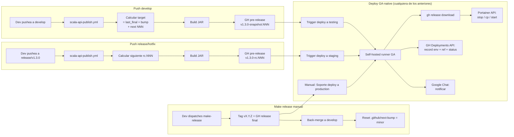

# Hito 2 — Spec del deploy GA-native

> **Estado:** decisiones de diseño cerradas internamente (D1–D7); dos consultas abiertas con Soporte Operativo (C1, C2). Ver §4 y §5. · Tracking: `docs/v2-sin-jenkins-roadmap.md` Hito 2.

Documento canónico del diseño del deploy GA-native que reemplaza a Jenkins en v2. Captura: principios, modelo de artefactos, convención de versionado, requisitos heredados de v1, decisiones tomadas y decisiones abiertas.

> **Documento complementario:** [`docs/v2-deploy-design-proposal-soporte.md`](./v2-deploy-design-proposal-soporte.md) contiene el razonamiento completo de cada decisión, el análisis de opciones descartadas, el mapeo a controles ISO 27001 y la matriz para visto/firma de Soporte. Este spec captura el **qué** final; el proposal captura el **por qué** y es el doc de revisión con Bruno/Jonathan/Elías.

## Principio rector

**v2 no depende de `BQN-UY/jenkins` para nada.** Ese repo (rama `production`, scripts groovy, `sistemas.json`, etc.) queda congelado como legacy v1. v2 lee su lógica sólo como referencia descriptiva — ningún workflow, runner, ni script invoca, importa o lee archivos de ese repo.

---

## 1. Tres grupos de proyectos

| Grupo | Ejemplos | Distribución | Versionado | Storage |
|---|---|---|---|---|
| **Server apps** | scala APIs, WARs, python servers | Auto-deploy a testing/staging/production por GA + runner self-hosted | `vX.Y.Z[-snapshot|-rc].NNN` | **GH Releases** del propio repo |
| **Client apps** | BPos, GPos, IDH (firmwares) | Instalación manual en equipos externos | TBD por equipo | TBD (probablemente GH Releases) |
| **Libs** | scala libs, protocolos comunes | Consumidas por builds | `<base>-SNAPSHOT` (Maven-standard) | **Nexus** `maven-snapshots` / `maven-releases` |

Este Hito 2 cubre **server apps**. Client apps y libs se documentan en sus propios specs/templates cuando corresponda.



---

## 2. Modelo de artefactos para server apps

### 2.1 Storage: GitHub Releases (no Nexus)

Los apps **no publican a Nexus**. Cada artefacto generado por CI vive como adjunto de un GitHub Release/Pre-release del propio repo:

- Auth simplificada: `GITHUB_TOKEN` del runner; sin credenciales Nexus.
- Single source of truth por proyecto: artefacto + git tag + release notes + sha en un solo lugar.
- Interfaz uniforme para deploy: `gh release download <tag>` para todo (testing, staging, production).
- Convergencia con el modelo natural de client apps (BPos/GPos/IDH también vivirían bien acá).

### 2.2 Convención de versionado

| Trigger | Tag GH | Tipo | Cleanup |
|---|---|---|---|
| push `develop` | `v<NEXT>-snapshot.NNN` | pre-release | sí (workflow) |
| push `release/vX.Y.Z` o `hotfix/vX.Y.Z-desc` | `vX.Y.Z-rc.NNN` | pre-release | no |
| `make-release` (workflow_dispatch) | `vX.Y.Z` | release final | no |

- **NNN**: 3 dígitos zero-padded (`001`, `002`, ..., `999`), auto-incrementa por trigger
- **`<NEXT>`**: versión target en develop, derivada de `last_final_tag + bump` donde `bump ∈ {minor, major}`
- **rc.NNN**: cada push a release/hotfix genera el siguiente RC automáticamente (no más `publish-rc` workflow_dispatch deliberado)
- Los snapshots y RCs son **pre-releases** en GH; los finales son releases marcados `latest`



**Lectura del diagrama**:
- Cada commit a develop genera un pre-release `v<NEXT>-snapshot.NNN`. NEXT se calcula con `last_final + bump` (acá `v1.2.0 + minor = v1.3.0`).
- `start-release` corta la rama; cada push a `release/v1.3.0` genera `v1.3.0-rc.NNN`.
- `make-release` crea el tag final `v1.3.0`, mergea a main y back-mergea a develop. El próximo push a develop arranca el ciclo de v1.4.0.

### 2.3 `.github/next-bump` — el bump del próximo release

Archivo en cada repo app, contenido: `minor` (default) o `major`.

**Quién lo actualiza**:
- Reusable workflow `update-next-bump.yml` (stack-agnóstico): se dispara en cada PR mergeado a develop. Si el PR tiene label `breaking-change` y el archivo dice `minor`, lo cambia a `major`, commit + push.
- `make-release.yml`: lee el archivo, aplica el bump al último final tag para calcular el target del release, y resetea el archivo a `minor` para el próximo ciclo.

**Edición manual permitida**: humanos pueden editar el archivo entre releases si la política cambió (p.ej., un breaking PR fue revertido y queremos volver a `minor`).



### 2.4 Cleanup de snapshots

Workflow `cleanup-snapshots.yml` (cron diario) por proyecto:
- Conserva **últimos 3** pre-releases con tag `v*-snapshot.*` por target version
- Borra el resto (pre-release + tag git asociado)
- RCs y releases finales nunca se tocan



### 2.5 Tag protection

Reglas en cada repo app (GH Settings → Tag protection):
- `v[0-9]*` (releases finales) → protegido contra delete y force-push
- `v*-rc.*` (RCs) → protegido contra delete y force-push
- `v*-snapshot.*` → libre (cleanup necesita borrarlos)

---

## 3. Baseline — qué hace el deploy v1 (Jenkins)

> **Sección descriptiva** — captura requisitos a cubrir, no dependencias de v2.

Resumen de `deploy-nexus.groovy` del repo `BQN-UY/jenkins`:

**Inputs** (por webhook GWT desde GitHub Actions): `SISTEMA`, `VERSION`, `ENVIRONMENT`, `ACTOR`, `INSTALLATION`, `RESTORE`.

**Flujo:**
1. Carga `sistemas.json`.
2. Resuelve `installations` para el `(sistema, environment)`.
3. Notifica inicio a Google Chat.
4. Si production → `input` manual con submitter restringido.
5. Si `RESTORE` → invoca `IDS/restoreDB`.
6. Por cada instalación, paralelo:
   - Resuelve URL del artefacto en Nexus (Search API).
   - Stop container (Portainer API).
   - Descarga JAR/WAR a localFile.
   - Copia a `deploy_path/target_name`.
   - Start container.
7. Registra deploy.
8. Notifica fin.

**Dependencias técnicas que v2 debe replicar (con tecnologías GA-native):**
- Acceso a Portainer (token).
- Acceso a artefactos (en v2: `gh release download` con `GITHUB_TOKEN`).
- Mapping `sistema → instalaciones → endpoints/containers/paths`.
- Notificaciones (Google Chat — se mantiene).
- Registro de deploys (en v2: GitHub Deployments API).
- Aprobación production (en v2: GH Environments required reviewers).

---

## 4. Decisiones tomadas

Decisiones base del modelo de artefactos y versionado (heredadas de Hito 2 original):

### 4.1 Modelo de artefactos
✅ Server apps usan **GitHub Releases** (no Nexus).  
✅ Libs siguen en **Nexus** con formato Maven-standard `<base>-SNAPSHOT`.

### 4.2 Versionado
✅ `vX.Y.Z-snapshot.NNN` / `vX.Y.Z-rc.NNN` / `vX.Y.Z` con NNN auto-incremental.  
✅ `.github/next-bump` con valores `minor|major`, mantenido por workflow + reseteo en make-release.  
✅ RCs auto en push (sin workflow_dispatch separado).

### 4.3 Cleanup y tag protection
✅ Cleanup: últimos **3** snapshots por target (workflow daily).  
✅ Tag protection: `v[0-9]*` y `v*-rc.*` protegidos; `v*-snapshot.*` libres.

### 4.4 Notificaciones
✅ Google Chat con dos canales ya existentes: **Deploy - Testing/Staging** y **Deploy - Production**. Workflow elige el canal según `environment`.

### 4.5 Registro de deploys
✅ **GitHub Deployments API** (nativo). Cada deploy crea un Deployment con env, ref, status. Sin servicio nuevo.

### 4.6 Restore DB
✅ Fuera de scope Hito 2 — se aborda en hito propio (operativos en GA, alineado con informe Jenkins §10 Fase 3).

---

Decisiones de diseño del deploy GA-native (razonamiento extendido en [`v2-deploy-design-proposal-soporte.md`](./v2-deploy-design-proposal-soporte.md)):

### D1 · Restart siempre forzado
✅ Todo deploy termina con `POST /containers/{id}/restart` incondicional tras escribir el artifact. Sin flag ni opt-out. Si eventualmente aparece un caso que requiere zero-downtime, se trata como feature nueva (rolling + múltiples réplicas), no como flag.

### D2 · Modelo de credenciales — β (GH primario + Keeper backup + Portainer Team scoping)

3 org secrets: GH como sistema primario de runtime, Keeper como backup explícito del valor + ledger, Portainer Teams como scoping real de privilegio. Regla operativa: escribir GH → respaldar Keeper en la misma sesión.

- `PORTAINER_TOKEN_DEPLOY` — backup en Keeper folder `prod-critical`, allowlist restringido a repos que declaran `environment: production`.
- `GCHAT_WEBHOOK_PRODUCTION` — backup en Keeper folder `prod-critical`, allowlist idem.
- `GCHAT_WEBHOOK_TESTING_STAGING` — backup en Keeper folder `testing-staging`, allowlist idem.

Control SoD 3-way (GH/Keeper/Portainer) + Jonathan como backup contingente de Bruno. Formalizado como estructura ISO existente, no como diseño ad-hoc. Cerrado en follow-up 2026-04-16 (ver acta [`v2-deploy-followup-bruno.md`](./v2-deploy-followup-bruno.md)).

**Runbook operativo por secret** (crear/cargar/rotar): [`v2-secrets-runbook.md`](./v2-secrets-runbook.md).

### D3 · Allowlist de repos prod por criterio objetivo
Un repo entra al allowlist de los 3 org secrets si y solo si declara al menos una instalación con `environment: production` en `.github/deploy.json`. Mantenimiento manual por Pablo/Bruno (ISO A.8.2). Criterio auditable automáticamente.

### D4 · Pilotos secuenciales antes de rollout masivo
1. **Piloto 1:** `acp-api` (scala-api/pekko).
2. **Piloto 2:** `colectivizacion` (tomcat/.war).

Criterios de éxito comunes para promover a rollout:
- ≥3 deploys consecutivos exitosos en testing.
- ≥1 deploy exitoso en staging.
- ≥1 rollback practicado (redeploy tag anterior).
- Soporte confirma operabilidad autónoma (un analista ejecuta end-to-end sin dev).

### D5 · Approvers de producción + fusible SoD

GH Environments:

```yaml
production:
  required_reviewers: [Pablo Zebraitis, Bruno Artola, Jonathan Correa Paiva, Elías Severino]
  prevent_self_review: OFF        # ver fusible
  required_approvals: 1
  deployment_branches: protected tags v[0-9]*
staging:
  required_reviewers: []          # auto-deploy
  deployment_branches: release/**, hotfix/**
testing:
  required_reviewers: []          # auto-deploy si auto_deploy: true
  deployment_branches: develop
```

**Fusible self-approval** (alternative control ISO A.8.3): step del workflow detecta si aprobador = originador del trigger. Si coinciden → alerta al canal Deploy-Production + justificación obligatoria (`workflow_dispatch input`) + registro en job output. No bloquea el deploy. Revisión trimestral por ISO Officer.

**Equipo IDS Development (Santi, Nacho, Jose) no entra al pool.** Regla explícita, no accidente. Su participación en el proceso termina en merge a `main` / push a `develop`; el CI reacciona automáticamente.

### D6 · Paths intra-container en `deploy.json`
`executable_path` es el path **dentro del container**, no en el host. El workflow escribe vía `PUT /containers/{id}/archive` a través del proxy Docker API de Portainer (sujeto a confirmación C1 — Opción C del runner).

Esto desacopla totalmente al CI/CD del layout del host. Cambiar un bind mount en compose no rompe el deploy. El dev escribe el path "que la app ve", no el path físico.

### D7 · Auto-deploy opt-in per-instalación
Cada instalación en `deploy.json` declara `auto_deploy: true` o lo omite. Default `false` (solo deploy manual). Preserva la semántica actual de `sistemas.json` v1 (casos como `sga_testing_crl`, `sga_testing_lpi` siguen requiriendo manual).

Cuando se publica un snapshot/RC y la instalación tiene `auto_deploy: false`, el workflow notifica al canal correspondiente con **⏸️ Deploy manual pendiente** + link directo al `workflow_dispatch` con tag pre-rellenado. Capability nueva de v2 (no existe en v1).

---

## 5. Decisiones abiertas (consultas activas con Soporte)

Dos consultas ya formuladas al canal de Soporte. Las respuestas condicionan parte del diseño.

### C1 · Arquitectura del runner — viabilidad de Opción C

Tres opciones evaluadas:

| Opción | Modelo | Resultado |
|---|---|---|
| A | 1 runner único + SSH/SCP a hosts | Descartada en propuesta (credenciales SSH nuevas, SPOF). Fallback si C no viable. |
| B | 1 runner por host | Descartada en propuesta (provisioning × N, superficie de credenciales distribuida). |
| **C** | 1 runner único + Docker API vía Portainer (escritura con `PUT /containers/{id}/archive`) | **Propuesta**. Runner 100% network-only en `docker-soporte`; reusa el token Portainer; sin credenciales SSH nuevas; sin provisioning por host. |

**Pregunta en curso:** para todos los server-apps actuales, ¿el `executable_path` está bind-mounted dentro del container? Si sí → C viable. Si hay casos de paths no bind-mounted (ej `/opt/webapps` centralizado) → A para esos casos puntuales.

### C2 · Identificación de containers en `deploy.json`

Propuesta: identificar por `stack + service + replicas[]` (labels de compose: `com.docker.compose.project`/`.service`), no por nombre de container (que en la mayoría de casos es autogenerado `<stack>-<servicio>-<replica>`).

Schema propuesto:

```yaml
installations:
  - id: acp-testing
    environment: testing
    portainer_endpoint: docker-soporte
    stack: acp_services
    service: acp-api
    replicas: [1, 2]            # opcional; omitido = todas
    executable_path: /app/lib/acp-api.jar
    auto_deploy: true
```

**Preguntas en curso:**
1. ¿`tcp_server` es hoy el único stack con réplicas múltiples? ¿Se esperan más en corto/mediano plazo?
2. ¿Hay containers sin stack de compose (standalone, creados manual) que requerirían identificación por nombre explícito?

---

## 6. Criterios de aceptación del spec

El spec se considera completo cuando responde:

- [x] (4.1–4.6) Modelo de artefactos, versionado, cleanup, tag protection, notificaciones, registro
- [x] (D1) Restart siempre forzado
- [x] (D2) Modelo de credenciales (org-level + Keeper + Portainer Team)
- [x] (D3) Allowlist de repos prod por criterio objetivo
- [x] (D4) Pilotos definidos con criterios de éxito
- [x] (D5) Approvers prod + fusible SoD
- [x] (D6) Paths intra-container
- [x] (D7) Auto-deploy opt-in per-instalación
- [ ] (C1) Arquitectura del runner — viabilidad de Opción C (consulta abierta con Soporte)
- [ ] (C2) Identificación de containers — réplicas y casos standalone (consulta abierta con Soporte)
- [ ] Conformidad firmada de Soporte Operativo sobre `v2-deploy-design-proposal-soporte.md`
- [ ] Diseño del composite `shared/deploy-*` y workflow `scala-api-deploy.yml` (Hito 3)
- [ ] Criterio de migración: cómo un repo v2 publish-only adopta el deploy GA-native (PR mecánico, Hito 3)

Cuando C1 + C2 + conformidad de Soporte estén resueltas → arranca Hito 3 (implementación).

---

## 7. Cambios al modelo v2 vigente que dispara este spec

Implementar este spec requiere cambios al CI-CD repo **antes** de tener el deploy GA-native:

1. **Reescribir `scala-api-publish.yml`**: stop publishing to Nexus; create GH pre-release `v<NEXT>-snapshot.NNN` (develop) or `vX.Y.Z-rc.NNN` (release/hotfix) con JAR adjunto.
2. **Modificar `scala-api-make-release.yml`**: stop publishing to Nexus; tag final + GH release + back-merge + bump `.github/next-bump` reset a `minor`.
3. **Eliminar `scala-api-publish-rc.yml`** y su template (RCs son auto en push).
4. **Crear `scala-api-cleanup-snapshots.yml`** (cron daily, conserva últimos 3 por target).
5. **Crear reusable `update-next-bump.yml`** (stack-agnóstico, dispara en PR merged con label `breaking-change`).
6. **Templates**: agregar `.github/next-bump` inicial, caller de cleanup, caller de update-next-bump.
7. **Cada app que migre**: remover config Nexus de `build.sbt`, agregar `.github/next-bump`, actualizar callers.

Estos cambios son **prerrequisito** del Hito 3 — sin ellos, los apps no tienen artefactos en GH Releases para que el deploy los consuma. Se ejecutan en su propio PR (no este).

---

## 8. Visión end-to-end (Hito 3)

Cómo se ve el flujo completo cuando todo esté implementado:



---

## 9. Próximos pasos

1. Compartir [`v2-deploy-design-proposal-soporte.md`](./v2-deploy-design-proposal-soporte.md) con Bruno, Jonathan y Elías vía Drive para obtener visto/firma sobre D1–D7 + respuestas a C1/C2.
2. Cuando lleguen las respuestas de C1 (runner/Opción C) y C2 (identificación de containers) → consolidar en §5 de este spec y en el proposal.
3. Firmado el proposal → arranca Hito 3 (implementación de composites + reusable workflows).
4. Durante Hito 3, Jenkins v1 permanece operativo como fallback hasta completar los dos pilotos + rollout por olas.

---

## 10. Navegación para AIs (Claude / Copilot)

Documentos por jerarquía de autoridad:

| Doc | Audiencia | Qué busca |
|---|---|---|
| **Este spec (`docs/v2-hito2-deploy-spec.md`)** | AIs + humanos | Modelo canónico de versionado y deploy v2 server apps. Si hay conflicto entre docs, **este gana**. |
| `docs/v2-deploy-design-proposal-soporte.md` | Humanos (Soporte + Dev) | Razonamiento extendido de cada decisión D1–D7, análisis de opciones descartadas, mapeo ISO 27001, matriz de conformidad. Doc de revisión con Soporte Operativo. |
| `CLAUDE.md` (root) | AI Claude | Reglas operativas del repo: dónde modificar, dónde no, ambientes válidos. |
| `templates/scala-api/CLAUDE.md` | AI Claude (proyectos) | Reglas para apps Scala individuales: branching, secrets, convenciones. |
| `.github/copilot-instructions.md` (root y template) | AI Copilot | Versión condensada de las reglas. |
| `docs/migration-v2.md` | Humanos | Catálogo de workflows + guía de migración. AIs lo consultan para detalle de un workflow específico. |
| `docs/v2-sin-jenkins-roadmap.md` | Humanos + AIs | Hoja de ruta a Escenario C. AIs lo consultan para entender en qué hito está el trabajo. |
| `docs/scala-migration-v2.md` | Humanos | Guía paso a paso para migrar un repo Scala existente. |

**Cuando el usuario pide cambios sobre el modelo de versionado o deploy de server apps**: actualizar primero **este spec**, después cascadear a CLAUDE.md / copilot-instructions / templates.

**Cuando el usuario pregunta "¿cómo versiona X?"**: consultar §2 de este spec.

**Cuando el usuario pregunta "¿v2 usa Jenkins?"**: NO. Ver Principio rector + `docs/v2-sin-jenkins-roadmap.md`.

**Cuando el usuario pregunta sobre libs**: este spec NO las cubre — siguen el modelo Maven-standard en Nexus. Cuando exista, ver `templates/scala-lib/`.
