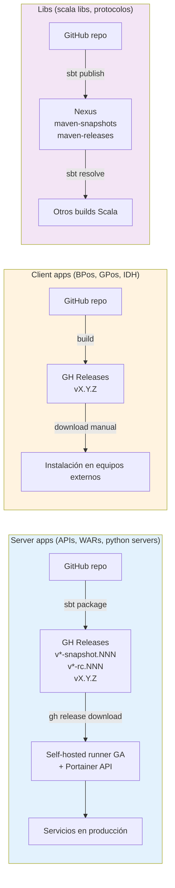
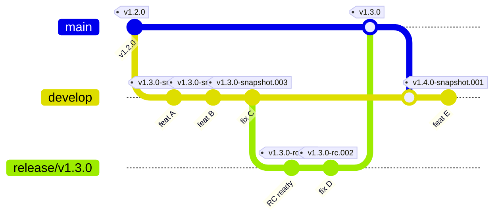
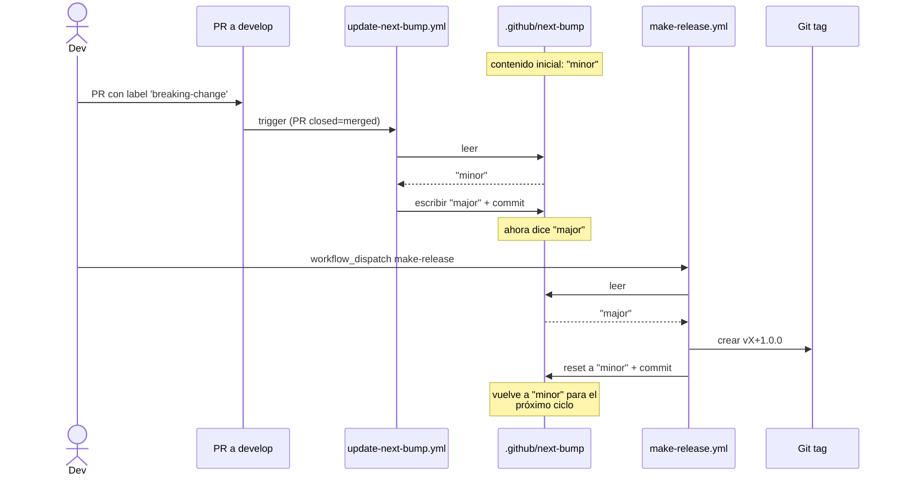
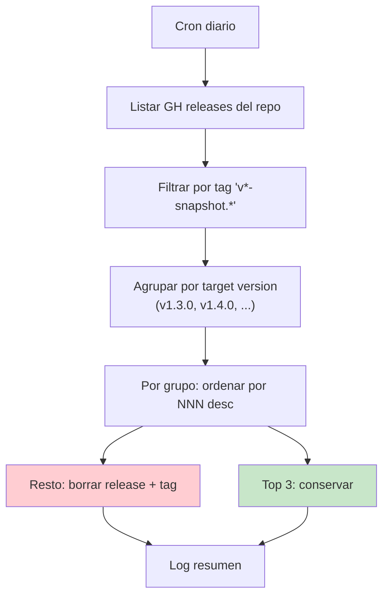
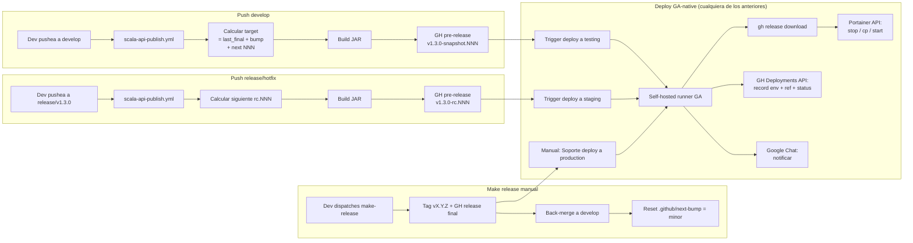

# Hito 2 — Spec del deploy GA-native

> Estado: **borrador en discusión** · Tracking: `docs/v2-sin-jenkins-roadmap.md` Hito 2

Documento canónico del diseño del deploy GA-native que reemplaza a Jenkins en v2. Captura: principios, modelo de artefactos, convención de versionado, requisitos heredados de v1, decisiones tomadas y decisiones abiertas.

## Principio rector

**v2 no depende de `BQN-UY/jenkins` para nada.** Ese repo (rama `production`, scripts groovy, `sistemas.json`, etc.) queda congelado como legacy v1. v2 lee su lógica sólo como referencia descriptiva — ningún workflow, runner, ni script invoca, importa o lee archivos de ese repo.

---

## 1. Tres grupos de proyectos

| Grupo | Ejemplos | Distribución | Versionado | Storage |
|---|---|---|---|---|
| **Server apps** | scala APIs, WARs, python servers | Auto-deploy a testing/staging/production por GA + runner self-hosted | `vX.Y.Z[-snapshot|-rc].NNN` | **GH Releases** del propio repo |
| **Client apps** | BPos, GPos, IDH (firmwares) | Instalación manual en equipos externos | TBD por equipo | TBD (probablemente GH Releases) |
| **Libs** | scala libs, protocolos comunes | Consumidas por builds | `<base>-SNAPSHOT` (Maven-standard) | **Nexus** `maven-snapshots` / `maven-releases` |

Este Hito 2 cubre **server apps**. Client apps y libs se documentan en sus propios specs/templates cuando corresponda.



---

## 2. Modelo de artefactos para server apps

### 2.1 Storage: GitHub Releases (no Nexus)

Los apps **no publican a Nexus**. Cada artefacto generado por CI vive como adjunto de un GitHub Release/Pre-release del propio repo:

- Auth simplificada: `GITHUB_TOKEN` del runner; sin credenciales Nexus.
- Single source of truth por proyecto: artefacto + git tag + release notes + sha en un solo lugar.
- Interfaz uniforme para deploy: `gh release download <tag>` para todo (testing, staging, production).
- Convergencia con el modelo natural de client apps (BPos/GPos/IDH también vivirían bien acá).

### 2.2 Convención de versionado

| Trigger | Tag GH | Tipo | Cleanup |
|---|---|---|---|
| push `develop` | `v<NEXT>-snapshot.NNN` | pre-release | sí (workflow) |
| push `release/vX.Y.Z` o `hotfix/vX.Y.Z-desc` | `vX.Y.Z-rc.NNN` | pre-release | no |
| `make-release` (workflow_dispatch) | `vX.Y.Z` | release final | no |

- **NNN**: 3 dígitos zero-padded (`001`, `002`, ..., `999`), auto-incrementa por trigger
- **`<NEXT>`**: versión target en develop, derivada de `last_final_tag + bump` donde `bump ∈ {minor, major}`
- **rc.NNN**: cada push a release/hotfix genera el siguiente RC automáticamente (no más `publish-rc` workflow_dispatch deliberado)
- Los snapshots y RCs son **pre-releases** en GH; los finales son releases marcados `latest`



**Lectura del diagrama**:
- Cada commit a develop genera un pre-release `v<NEXT>-snapshot.NNN`. NEXT se calcula con `last_final + bump` (acá `v1.2.0 + minor = v1.3.0`).
- `start-release` corta la rama; cada push a `release/v1.3.0` genera `v1.3.0-rc.NNN`.
- `make-release` crea el tag final `v1.3.0`, mergea a main y back-mergea a develop. El próximo push a develop arranca el ciclo de v1.4.0.

### 2.3 `.github/next-bump` — el bump del próximo release

Archivo en cada repo app, contenido: `minor` (default) o `major`.

**Quién lo actualiza**:
- Reusable workflow `update-next-bump.yml` (stack-agnóstico): se dispara en cada PR mergeado a develop. Si el PR tiene label `breaking-change` y el archivo dice `minor`, lo cambia a `major`, commit + push.
- `make-release.yml`: lee el archivo, aplica el bump al último final tag para calcular el target del release, y resetea el archivo a `minor` para el próximo ciclo.

**Edición manual permitida**: humanos pueden editar el archivo entre releases si la política cambió (p.ej., un breaking PR fue revertido y queremos volver a `minor`).



### 2.4 Cleanup de snapshots

Workflow `cleanup-snapshots.yml` (cron diario) por proyecto:
- Conserva **últimos 3** pre-releases con tag `v*-snapshot.*` por target version
- Borra el resto (pre-release + tag git asociado)
- RCs y releases finales nunca se tocan



### 2.5 Tag protection

Reglas en cada repo app (GH Settings → Tag protection):
- `v[0-9]*` (releases finales) → protegido contra delete y force-push
- `v*-rc.*` (RCs) → protegido contra delete y force-push
- `v*-snapshot.*` → libre (cleanup necesita borrarlos)

---

## 3. Baseline — qué hace el deploy v1 (Jenkins)

> **Sección descriptiva** — captura requisitos a cubrir, no dependencias de v2.

Resumen de `deploy-nexus.groovy` del repo `BQN-UY/jenkins`:

**Inputs** (por webhook GWT desde GitHub Actions): `SISTEMA`, `VERSION`, `ENVIRONMENT`, `ACTOR`, `INSTALLATION`, `RESTORE`.

**Flujo:**
1. Carga `sistemas.json`.
2. Resuelve `installations` para el `(sistema, environment)`.
3. Notifica inicio a Google Chat.
4. Si production → `input` manual con submitter restringido.
5. Si `RESTORE` → invoca `IDS/restoreDB`.
6. Por cada instalación, paralelo:
   - Resuelve URL del artefacto en Nexus (Search API).
   - Stop container (Portainer API).
   - Descarga JAR/WAR a localFile.
   - Copia a `deploy_path/target_name`.
   - Start container.
7. Registra deploy.
8. Notifica fin.

**Dependencias técnicas que v2 debe replicar (con tecnologías GA-native):**
- Acceso a Portainer (token).
- Acceso a artefactos (en v2: `gh release download` con `GITHUB_TOKEN`).
- Mapping `sistema → instalaciones → endpoints/containers/paths`.
- Notificaciones (Google Chat — se mantiene).
- Registro de deploys (en v2: GitHub Deployments API).
- Aprobación production (en v2: GH Environments required reviewers).

---

## 4. Decisiones tomadas

### 4.1 Modelo de artefactos
✅ Server apps usan **GitHub Releases** (no Nexus).  
✅ Libs siguen en **Nexus** con formato Maven-standard `<base>-SNAPSHOT`.

### 4.2 Versionado
✅ `vX.Y.Z-snapshot.NNN` / `vX.Y.Z-rc.NNN` / `vX.Y.Z` con NNN auto-incremental.  
✅ `.github/next-bump` con valores `minor|major`, mantenido por workflow + reseteo en make-release.  
✅ RCs auto en push (sin workflow_dispatch separado).

### 4.3 Cleanup y tag protection
✅ Cleanup: últimos **3** snapshots por target (workflow daily).  
✅ Tag protection: `v[0-9]*` y `v*-rc.*` protegidos; `v*-snapshot.*` libres.

### 4.4 Modelo de "instalaciones" para deploy
✅ **B + C combinados**:
- `.github/deploy.json` (o `.yml`) en cada repo: lista de instalaciones por environment (`portainer_endpoint`, `portainer_container`, `deploy_path`, `target_name`, `auto_deploy`). Versionado con el código.
- GH Environments por env (testing/staging/production): secrets/tokens/URLs sensibles, required reviewers para production.

### 4.5 Aprobación production
✅ GH Environments `required reviewers`.  
🟡 Pendiente confirmar lista de submitters (mantener `admins,soporte,auxiliar_soporte` o ajustar).

### 4.6 Notificaciones
✅ Mantener Google Chat (continuidad con Soporte).

### 4.7 Registro de deploys
✅ **GitHub Deployments API** (nativo). Cada deploy crea un Deployment con env, ref, status. Sin servicio nuevo.

### 4.8 Restore DB
✅ Fuera de scope Hito 2 — se aborda en hito propio (operativos en GA, alineado con informe Jenkins §10 Fase 3).

---

## 5. Decisiones abiertas (input de Soporte/IDS)

### 5.1 Self-hosted runner GA — ¿dónde y cuántos?

| Opción | Pros | Contras |
|---|---|---|
| **A. Un runner único** (en `DEPLOY_IP` u otro host) | Mínimo a operar | SPOF; el `cp` al host destino debe ser remoto (SSH) |
| **B. Un runner por endpoint Portainer** | `cp` local; paraleliza naturalmente | N runners a mantener; más superficie |
| **C. Runners labeled** (subset, p.ej. uno por DC) | Equilibrio paralelismo/superficie | Diseñar labeling y routing |

> **Pregunta**: ¿cuántos `portainer_endpoint` distintos hay hoy y cómo están distribuidos geográficamente?

### 5.2 Mecanismo de deploy — ¿cómo llegamos al artefacto en el container?

| Opción | Cómo funciona | Encaja si |
|---|---|---|
| **α. Portainer API** | stop → recreate via API (artefacto vía volumen Docker o rebuild de imagen) | Containers totalmente gestionados por Portainer |
| **β. SSH + Docker** | runner SSH al host, `docker stop && cp && docker start` | Hosts tienen Docker + SSH abierto |
| **γ. SCP + systemd** | runner SCP el JAR, `systemctl restart` | Services como units systemd, sin containers |

> **Pregunta**: ¿services todos containerizados? ¿JAR/WAR en volumen o dentro de la imagen?

### 5.3 Schema de `.github/deploy.json`

Borrador (sujeto a refinar tras 5.1 y 5.2):

```json
{
  "environments": {
    "testing":    { "installations": [ { "name": "...", "portainer_endpoint": "...", "portainer_container": "...", "deploy_path": "/opt/webapps", "target_name": "...", "auto_deploy": true } ] },
    "staging":    { "installations": [ ... ] },
    "production": { "installations": [ ... ] }
  }
}
```

> **Pregunta**: ¿campos extra que faltan respecto a `sistemas.json` v1? ¿Algún proyecto tiene casos edge no cubiertos?

---

## 6. Criterios de aceptación del spec

El spec se considera completo cuando responde:

- [ ] (5.1) Runner GA: cantidad, ubicación, plan de instalación
- [ ] (5.2) Mecanismo de deploy elegido (α/β/γ) con ejemplo end-to-end
- [ ] (5.3) Schema final de `.github/deploy.json`
- [x] (4.x) Resto de decisiones tomadas
- [ ] Lista de secrets/vars nuevos requeridos por el runner (Portainer token, SSH keys, etc.)
- [ ] Diseño del composite `shared/deploy-*` y workflow `scala-api-deploy.yml`
- [ ] Criterio de migración: cómo un repo v2 publish-only adopta el deploy GA-native (PR mecánico)

Cuando el spec esté completo → arranca Hito 3 (implementación).

---

## 7. Cambios al modelo v2 vigente que dispara este spec

Implementar este spec requiere cambios al CI-CD repo **antes** de tener el deploy GA-native:

1. **Reescribir `scala-api-publish.yml`**: stop publishing to Nexus; create GH pre-release `v<NEXT>-snapshot.NNN` (develop) or `vX.Y.Z-rc.NNN` (release/hotfix) con JAR adjunto.
2. **Modificar `scala-api-make-release.yml`**: stop publishing to Nexus; tag final + GH release + back-merge + bump `.github/next-bump` reset a `minor`.
3. **Eliminar `scala-api-publish-rc.yml`** y su template (RCs son auto en push).
4. **Crear `scala-api-cleanup-snapshots.yml`** (cron daily, conserva últimos 3 por target).
5. **Crear reusable `update-next-bump.yml`** (stack-agnóstico, dispara en PR merged con label `breaking-change`).
6. **Templates**: agregar `.github/next-bump` inicial, caller de cleanup, caller de update-next-bump.
7. **Cada app que migre**: remover config Nexus de `build.sbt`, agregar `.github/next-bump`, actualizar callers.

Estos cambios son **prerrequisito** del Hito 3 — sin ellos, los apps no tienen artefactos en GH Releases para que el deploy los consuma. Se ejecutan en su propio PR (no este).

---

## 8. Visión end-to-end (Hito 3)

Cómo se ve el flujo completo cuando todo esté implementado:



---

## 9. Próximos pasos

1. Compartir este spec con Soporte/IDS para responder §5.1, §5.2, §5.3.
2. Cuando estén las respuestas → consolidar en este mismo PR.
3. Mergear → habilita la ejecución de §7 y luego Hito 3.

---

## 10. Navegación para AIs (Claude / Copilot)

Documentos por jerarquía de autoridad:

| Doc | Audiencia | Qué busca |
|---|---|---|
| **Este spec (`docs/v2-hito2-deploy-spec.md`)** | AIs + humanos | Modelo canónico de versionado y deploy v2 server apps. Si hay conflicto entre docs, **este gana**. |
| `CLAUDE.md` (root) | AI Claude | Reglas operativas del repo: dónde modificar, dónde no, ambientes válidos. |
| `templates/scala-api/CLAUDE.md` | AI Claude (proyectos) | Reglas para apps Scala individuales: branching, secrets, convenciones. |
| `.github/copilot-instructions.md` (root y template) | AI Copilot | Versión condensada de las reglas. |
| `docs/migration-v2.md` | Humanos | Catálogo de workflows + guía de migración. AIs lo consultan para detalle de un workflow específico. |
| `docs/v2-sin-jenkins-roadmap.md` | Humanos + AIs | Hoja de ruta a Escenario C. AIs lo consultan para entender en qué hito está el trabajo. |
| `docs/scala-migration-v2.md` | Humanos | Guía paso a paso para migrar un repo Scala existente. |

**Cuando el usuario pide cambios sobre el modelo de versionado o deploy de server apps**: actualizar primero **este spec**, después cascadear a CLAUDE.md / copilot-instructions / templates.

**Cuando el usuario pregunta "¿cómo versiona X?"**: consultar §2 de este spec.

**Cuando el usuario pregunta "¿v2 usa Jenkins?"**: NO. Ver Principio rector + `docs/v2-sin-jenkins-roadmap.md`.

**Cuando el usuario pregunta sobre libs**: este spec NO las cubre — siguen el modelo Maven-standard en Nexus. Cuando exista, ver `templates/scala-lib/`.
