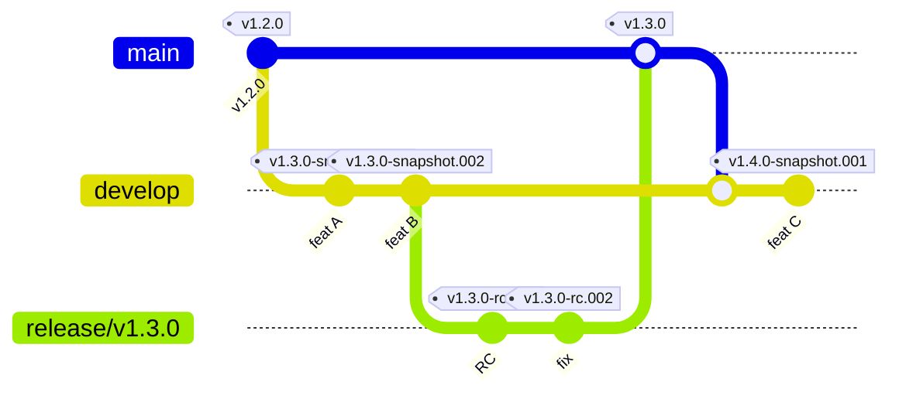

# CI/CD v2 — Contexto para AI

Este proyecto usa CI/CD v2 de BQN-UY. La lógica de CI/CD vive en `BQN-UY/CI-CD`
como **reusable workflows** (`.github/workflows/scala-api-*.yml`) que internamente
componen las composite actions del repo. Los workflows de este proyecto son
**callers cortos** que apuntan al reusable workflow correspondiente con `@v2`.

Esto significa que cualquier cambio en la lógica de CI/CD se hace una sola vez
en `BQN-UY/CI-CD` y se propaga automáticamente a todos los proyectos que pinean
`@v2`. Los archivos `.github/workflows/*.yml` de este repo solo cambian cuando
hay que ajustar inputs o triggers específicos del proyecto.

## Contexto organizacional (unidad Banquinet)

Equipo, roles, restricciones estructurales, herramientas, stakeholders y política IA de la unidad Banquinet: [`BQN-UY/banquinet/README.md@7ed73a7`](https://github.com/BQN-UY/banquinet/blob/7ed73a725db88473de9d32d87007b6dbc0db3ea1/README.md) (permalink al commit fijo). Útil para razonar sobre alcance, estimación y quién decide/aprueba. **Actualizar el sha del permalink cuando cambie el README canónico** del repo `BQN-UY/banquinet`.

## Branching model

### Ramas de trabajo (corta duración — siempre via PR)

| Rama | Sale de | Merge hacia | Label PR | Cuándo usar |
|---|---|---|---|---|
| `feature/*` | `develop` | `develop` | `feature` | Nueva funcionalidad retrocompatible |
| `fix/*` | `develop` · `release/**` · `hotfix/**` | mismo origen | `fix` | Corrección de bug |
| `chore/*` | `develop` | `develop` | `chore` | Mantenimiento: configuración, CI, tests |
| `docs/*` | `develop` | `develop` | `chore` | Documentación |
| `refactor/*` | `develop` | `develop` | `chore` | Refactoring sin cambio de comportamiento |
| `dependabot/*` | `develop` | `develop` | `update` | Actualización de dependencias (Dependabot) |
| `scala-steward/*` | `develop` | `develop` | `update` | Actualización de dependencias (Scala Steward) |

> `fix/*` es el único tipo que puede salir de una rama distinta a `develop`.
> Un `fix/*` desde `release/**` corrige un bug detectado durante el testeo del RC.
> Un `fix/*` desde `hotfix/**` corrige un bug secundario descubierto dentro del hotfix.
>
> `dependabot/*` y `scala-steward/*` son creadas automáticamente por las herramientas — no crearlas manualmente.
> `auto-label` les asigna `update` automáticamente; Dependabot también se configura con `labels: ["update"]` en `.github/dependabot.yml`.

### Ramas de ciclo (larga duración — gestionadas por workflows)

| Rama | Sale de | Cierra con | Propósito |
|---|---|---|---|
| `develop` | — | — | Integración continua de la próxima versión |
| `release/vX.Y.Z` | `develop` via `start-release` | `make-release` → `main` | Estabilización del RC |
| `hotfix/vX.Y.Z-desc` | `main` via `start-hotfix` | `make-release` → `main` | Fix urgente a producción |
| `main` | — | — | Producción |

## Storage y versionado de artefactos

> **Importante**: este proyecto es un **server app** — los artefactos NO van a Nexus. Cada build genera un GitHub Release/Pre-release del propio repo con el JAR adjunto. (Las libs sí van a Nexus; ver `BQN-UY/CI-CD/docs/v2-hito2-deploy-spec.md` §1.)

| Trigger | Tag GH | Tipo | Cleanup | Ambiente del deploy |
|---|---|---|---|---|
| push `develop` | `v<NEXT>-snapshot.NNN` | pre-release | sí (workflow daily, conserva últimos 3 por target) | testing |
| push `release/vX.Y.Z` | `vX.Y.Z-rc.NNN` | pre-release | no | staging |
| push `hotfix/vX.Y.Z-desc` | `vX.Y.Z-rc.NNN` | pre-release | no | staging |
| `make-release` (manual) | `vX.Y.Z` | release final | no | production (manual por Soporte) |

- **NNN**: 3 dígitos zero-padded (`001`, `002`, ...), auto-incrementa por trigger
- **`<NEXT>`**: versión target para develop, calculada como `last_final_tag + bump` donde `bump` se lee de `.github/next-bump`
- RCs son auto en cada push a release/hotfix — no hay workflow_dispatch manual para crear RC



## `.github/next-bump`

Archivo en este repo, contenido: `minor` (default) o `major`.

- Cuando se mergea un PR a `develop` con label `breaking-change`, el workflow `update-next-bump.yml` lo cambia a `major` (commit + push).
- `make-release.yml` lo lee, aplica el bump al último final tag para calcular el target del release, y lo resetea a `minor` para el próximo ciclo.
- Edición manual permitida si la política cambió (ej. un breaking PR fue revertido).

## Tag protection (configurar en GH Settings → Tag protection rules)

| Patrón | Protegido contra | Razón |
|---|---|---|
| `v[0-9]*` | delete + force-push | releases finales son inmutables |
| `v*-rc.*` | delete + force-push | RCs auditados son inmutables |
| `v*-snapshot.*` | (libre) | cleanup workflow necesita borrarlos |

## Reglas críticas

- `feature/*`, `chore/*`, `docs/*`, `refactor/*` salen **siempre** de `develop` — nunca de `release/**` ni `hotfix/**`
- `fix/*` desde `release/**` → corrige un bug del RC en curso; PR hacia `release/vX.Y.Z`, **NUNCA hacia `develop`**
- `fix/*` desde `hotfix/**` → corrige un bug secundario del hotfix; PR hacia `hotfix/vX.Y.Z-desc`
- `dependabot/*` y `scala-steward/*` apuntan **siempre a `develop`** — nunca a `release/**` ni `hotfix/**`
- `deploy-action` se usa cuando el PR requiere una acción manual en infra antes o durante el deploy (ej. nueva variable de entorno, migración de DB, nuevo secret, nuevo componente de infra). Reemplaza al label de tipo (`feature`, `fix`, etc.) — describir el tipo de cambio en el cuerpo del PR y la acción requerida en la sección "Deploy action requerida"
- `develop` después de `start-release` → próxima versión, no afecta el release en curso
- Los fixes de `release/**` vuelven a `develop` al final via back-merge automático de `make-release`
- `hotfix/**` es exclusivo para fixes urgentes de la versión en producción — no mezclar con features
- `make-release` es irreversible — solo ejecutar cuando el release fue validado en testing

## Workflows

| Archivo | Trigger | Qué hace |
|---|---|---|
| `ci.yml` | PR → develop · push release/\*\* · push hotfix/\*\* | lint + build + security |
| `publish.yml` | push develop · push release/\*\* · push hotfix/\*\* | build JAR + GH pre-release con tag `v*-snapshot.NNN` o `v*-rc.NNN` |
| `start-release.yml` | manual (workflow_dispatch) | crea `release/vX.Y.Z` desde develop (versión leída de `.github/next-bump`) |
| `make-release.yml` | manual (workflow_dispatch) | tag final `vX.Y.Z` + GH release + back-merge a develop + reset `.github/next-bump` |
| `start-hotfix.yml` | manual (workflow_dispatch) | crea `hotfix/vX.Y.Z-desc` desde main |
| `cleanup-snapshots.yml` | cron daily | borra pre-releases `v*-snapshot.*` viejos (conserva últimos 3 por target) |
| `update-next-bump.yml` | PR closed (merged) en develop | si el PR tiene label `breaking-change`, setea `.github/next-bump` a `major` |
| `setup-labels.yml` | manual (workflow_dispatch) | crea/sincroniza las labels estándar (tipo + `size/*`) — correr al inicializar el repo |

> Las labels `size/xs..xl` son informativas y las asigna automáticamente `pr-size-label` en cada PR según líneas y archivos modificados. No reemplazan al label de tipo — `label-check` sigue exigiendo exactamente una de `feature` / `fix` / `chore` / `update` / `deploy-action` / `breaking-change`.

## Secrets y variables

| Secret / Variable | Nivel | Uso |
|---|---|---|
| `NEXUS_USER` / `NEXUS_PASSWORD` | repo | **Resolver** dependencias desde el Nexus privado BQN (sbt resolve). NO se usan para publicar — server apps publican a GH Releases. |
| `GITHUB_TOKEN` | auto-provisto | Crear tags, releases, deployments en el propio repo |

- `NEXUS_URL` ya **no se requiere** (antes era para `publishTo`, que ya no se usa).
- Cuando el deploy GA-native esté listo (Hito 3, ver `docs/v2-hito2-deploy-spec.md`), se agregarán secrets para Portainer / SSH según el mecanismo elegido.
- Los secrets `JENKINS_DEPLOY_*` y `vars.SISTEMA` que aparecen en proyectos v1 **NO aplican** a server apps en v2. Si están configurados en el repo, se pueden eliminar tras la migración.

## Convención de configuración

Cada proyecto Scala API mantiene tres `application.conf` con roles bien diferenciados:

### 1. `application.conf` (raíz del proyecto) — configuración Pekko

Relativamente estático. Solo contiene los includes de Pekko y las sobreescrituras del bloque `pekko {}` (loggers, loglevel, actor provider, dispatchers). **No incluye configuración de la aplicación.**

```hocon
# Main application configuration
include "version"                    # Configuraciones de versión (si existen)
include "pekko-reference"            # Configuración base de Pekko
include "pekko-http-core-reference"  # Configuración del núcleo HTTP
include "pekko-http-reference"       # Rutas y extensiones HTTP

pekko {
  loggers = ["org.apache.pekko.event.slf4j.Slf4jLogger"]
  loglevel = "DEBUG"
  ...
}
```

### 2. `docs/application.conf` — configuración de referencia (sin secretos)

Documenta todas las claves que requiere el sistema según su `AppConfig`. Se incluye en el repositorio y es de lectura pública. Incorpora los `reference.conf` del framework (Pekko + framework BQN) con una sola línea. Reglas:

- Empieza con `include "reference"  # Includes all reference.conf settings`
- Solo incluye configuración de la aplicación — no repite el bloque `pekko {}` del raíz
- Reemplaza passwords y tokens con `"••••••••"` — nunca exponer credenciales reales
- Sirve de guía para configurar un ambiente nuevo

### 3. `src/test/resources/application.conf` — configuración de service tests

Usada por los tests de integración HTTP que ejercitan los endpoints de la propia API. Se incluye en el repositorio con valores de testing (no producción). Reglas:

- Empieza con `include "reference"  # Includes all reference.conf settings`
- Contiene la configuración completa del servidor (igual estructura que `docs/application.conf`)
- Agrega el bloque del cliente HTTP de la propia API para que los tests puedan conectarse:

```hocon
# Token de acceso para los service tests.
# Puede ser un token estático de fixed-tokens o un accessToken de bsecurity.
access-token = ""

# Cliente HTTP apuntando al servidor bajo test.
nombre-api {
  url = "http://localhost:8080"
# url = "https://api.testing.banquinet.org/nombre-api"
  connection-timeout            = 3 seconds
  request-timeout               = 10 seconds
  max-connections               = 10
  max-retries                   = 3
  max-open-requests             = 32
  circuit-breaker-max-failures  = 5
  circuit-breaker-reset-timeout = 20 seconds
  check-connection-task {
    enabled       = false
    initial-delay = "1 min"
    interval      = "10 min"
    inactive      = []
  }
  dispatcher {
    type = Dispatcher
    executor = "thread-pool-executor"
    thread-pool-executor { fixed-pool-size = 4 }
    throughput = 1
  }
}
```

La URL local queda activa por defecto; la URL de testing se comenta con `#` para cambiar rápidamente de target sin modificar el archivo.

## Qué NO hacer

- No agregar lógica de build/deploy directamente en los workflows — usar las actions de `BQN-UY/CI-CD`
- No hardcodear versiones de Java — el default (`"21"`) está en `backend/scala/lint-build`
- No usar nombres de secrets distintos a los documentados arriba
- No modificar el branching model — `develop` nunca mergea directo a `main`
- No commitear en `develop` para resolver un issue de un release en curso
- **No publicar a Nexus desde este repo** — server apps en v2 publican a GH Releases. Si `build.sbt` tiene `publishTo` apuntando a Nexus, removerlo en la migración.
- **No declarar `dynverSeparator` ni `dynverSonatypeSnapshots`** en `build.sbt` — son settings para libs (Maven), no para apps. La versión la calcula el workflow y se pasa como tag GH.
- **No invocar `jenkins-deploy-trigger`** ni usar secrets `JENKINS_DEPLOY_*` — v2 server apps no dependen de Jenkins (ver `BQN-UY/CI-CD/docs/v2-sin-jenkins-roadmap.md`).
- **No borrar tags `v[0-9]*` ni `v*-rc.*`** — están protegidos por convención (configurar tag protection en GH Settings).
